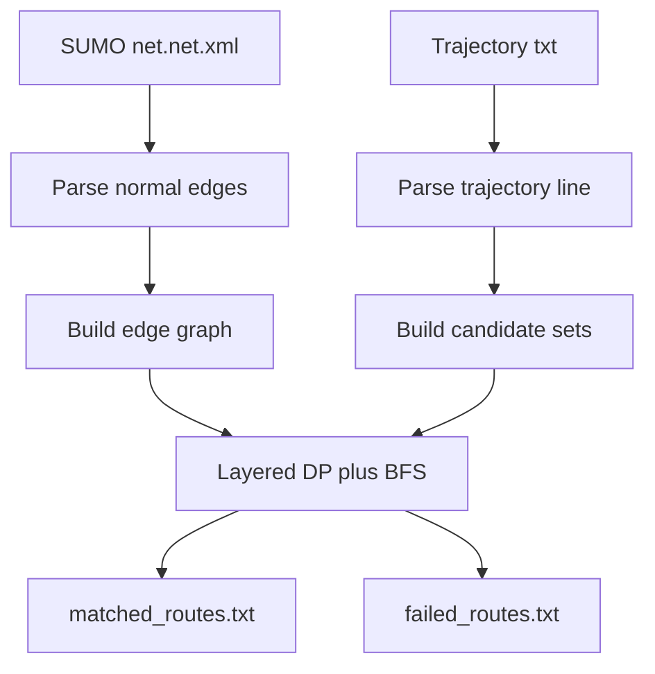

# SUMO Edge Matching README

## 1. 目标

这一组脚本的目标是把基于 OSM 边 ID 的车辆轨迹，映射成 SUMO 路网中的一条可连通 `edge` 序列。

当前实现拆成三个主要模块：

- `build_sumo_edge_graph.py`
- `match_sumo_edges.py`
- `parse_trajectories.py`

其中：

- `build_sumo_edge_graph.py` 负责读取 SUMO 的 `net.net.xml`，并建立“以 SUMO edge 为节点”的有向图。
- `match_sumo_edges.py` 负责候选映射、局部缓存查询、BFS 最短路和分层动态规划匹配。
- `parse_trajectories.py` 负责读取轨迹文件、逐条处理轨迹，并调用匹配模块完成批量输出。


## 2. 整体处理流程

完整流程可以概括为下面 6 步：

1. 读取 SUMO 路网 XML。
2. 提取普通 SUMO edge，忽略 internal edge，并过滤掉 `passenger` 不能进入的 edge。
3. 根据 `<connection>` 建立 SUMO edge 图，只保留对 `passenger` 合法的转移。
4. 逐行读取轨迹文件，解析出 `vin`、`timestamps`、`osm_edges`。
5. 对每条轨迹执行“候选映射 + 局部邻居缓存查询 + BFS 最短路 + 分层动态规划”，得到满足顺序约束的最短 SUMO edge 序列。
6. 在写入 `matched_routes.txt` 前，做一次简单环路清理（`A B A -> A`），去掉“出去一步又回到原边”的冗余片段。




## 3. SUMO 路网解析与建图

文件：`analysis/matching/build_sumo_edge_graph.py`

### 3.1 为什么图的节点是 edge

这里不是把 SUMO 的 junction 或 node 当图节点，而是把 **SUMO edge 本身** 当成图节点。

原因是后续匹配的目标是输出一条 SUMO edge 序列，因此直接把 edge 当节点更自然：

- 图节点：`sumo_edge_id`
- 图边：`edge A -> edge B` 表示车辆可以合法从 `A` 行驶到 `B`

### 3.2 解析规则

脚本会流式读取 `net.net.xml`，提取所有普通 edge：

- 忽略 `id` 以 `:` 开头的 edge
- 忽略 `function="internal"` 的 edge
- 结合 `<type>` 默认权限与 `<lane>` 上的 `allow/disallow`，过滤掉 `passenger` 不可进入的 edge

每条普通 edge 会保留这些信息：

- `edge_id`
- `from_node`
- `to_node`
- `priority`
- `edge_type`
- `function`
- `lanes`
  - `lane_id`
  - `length`
  - `speed`
  - `allow_classes`
  - `disallow_classes`

对应的数据结构：

- `LaneInfo`
- `EdgeInfo`
- `SumoEdgeGraph`

### 3.3 建图规则

建图完全基于 `net.net.xml` 里的 `<connection>` 元素，但前提是边本身对 `passenger` 可通行。

如果存在：

- `from="A"`
- `to="B"`

并且 `A` 和 `B` 都是普通 edge，且都允许 `passenger` 进入，那么就在图中加入：

- `A -> B`

最终得到两个结构：

- `graph[from_edge] = {to_edge_1, to_edge_2, ...}`
- `reverse_graph[to_edge] = {from_edge_1, ...}`

### 3.4 内存组织

`load_sumo_edge_graph()` 返回：

- `edges`
- `graph`
- `reverse_graph`

这三个结构会常驻内存，供后续所有轨迹复用，避免重复解析路网。

当前默认的建图目标是小汽车，因此 `load_sumo_edge_graph()` 默认按 `vehicle_class="passenger"` 过滤边与连接。


## 4. 轨迹文件解析

文件：`analysis/matching/parse_trajectories.py`

### 4.1 输入格式

每一行表示一条轨迹：

```text
vin timestamp_1 osm_edge_1 timestamp_2 osm_edge_2 ...
```

例如：

```text
1 08:10:50 272203513 08:11:09 700017191 08:11:18 321303382
```

### 4.2 解析结果

每一行会解析成一个 `TrajectoryRecord`：

- `vin`
- `timestamps`
- `osm_edges`
- `line_no`

### 4.3 异常行处理

如果某一行不满足以下条件，就不会让程序崩溃：

- 非空
- 至少 3 个字段
- 第一个字段为 `vin`
- 后续字段数量为偶数
- 每个时间戳匹配 `hh:mm:ss`

异常行会：

- 输出 warning 到标准错误
- 记录到 `BadLineInfo`
- 在流式处理中跳过

### 4.4 为什么使用流式读取

轨迹文件可能很大，因此脚本使用：

- `iter_trajectory_file()`

逐条产出轨迹，而不是先一次性把全部轨迹读进内存。

也就是说，运行时的策略是：

- 路网一次性读入内存
- 轨迹逐行读取、逐条匹配、逐条写出

这样做的优点是：

- 内存占用更稳定
- 更适合后续增加更复杂的匹配逻辑
- 可以直接扩展为大文件批处理


## 5. OSM edge 到 SUMO candidate edge 的映射

### 5.1 问题背景

一个 OSM 边在 SUMO 里不一定只对应一个 edge。

例如 OSM 边 `12345` 在 SUMO 中可能出现为：

- `12345`
- `12345#0`
- `12345#1`
- `-12345`
- `-12345#0`
- `-12345#1`

因此，一个 OSM edge 必须先映射成一个候选集合。

### 5.2 当前规则

对于一个 OSM 边 `osm_edge_id`，脚本认为下面这些 SUMO edge 都是候选：

- 精确等于 `osm_edge_id`
- 以 `osm_edge_id + "#"` 开头
- 精确等于 `"-" + osm_edge_id`
- 以 `"-" + osm_edge_id + "#"` 开头

internal edge 不会进入候选集，因为建图阶段已经把它们过滤掉了。

### 5.3 代码实现方式

脚本先对所有普通 SUMO edge 建立一个索引：

- `build_osm_candidate_index(valid_edges)`

这个索引会把：

- `12345`
- `12345#1`
- `-12345#2`

都归到 OSM 基础 key `12345` 下。

这样后续查找某个 OSM edge 的候选时，只需：

- `get_candidate_sumo_edges(osm_edge_id, valid_edges, candidate_index)`

返回结果会按 `edge_id` 排序，保证调试和复现稳定。


## 6. 匹配问题的数学形式

对一条轨迹，假设解析出的 OSM 边序列是：

```text
osm_1, osm_2, ..., osm_k
```

先把它映射成候选集合序列：

```text
C1, C2, ..., Ck
```

其中：

- `Ci` 是第 `i` 个 OSM 边对应的一组 SUMO edge 候选

目标是找到一条 SUMO edge 路径 `P`，使得：

1. `P` 中按顺序命中 `C1, C2, ..., Ck`
2. `P` 在 SUMO edge 图上连通
3. 在所有满足条件的路径中，`P` 最短

这里“最短”的定义是：

- 经过的 SUMO edge 数量最少

注意，这不是简单的局部贪心问题。因为：

- 某一层选一个“眼前最近”的候选，可能导致后面整体路径更长

因此实现中采用的是：

- **分层动态规划 + 邻居缓存 + BFS 最短路**


## 7. 为什么不能用简单贪心

假设有三层候选：

```text
C1 = {a1, a2}
C2 = {b1, b2}
C3 = {c1, c2}
```

如果只在 `C1 -> C2` 这一步里选“最近”的候选，很可能会得到：

- 前半段更短
- 但后半段更长

最后整体反而不是最优。

因此实现中会同时考虑所有层之间的连接，把“全局总代价”作为优化目标。


## 8. 局部缓存与 BFS 最短路

### 8.1 使用场景

在两个相邻候选层之间，例如：

- 上一层候选 `u in Ci`
- 下一层候选 `v in Ci+1`

需要求：

- 从 `u` 到 `v` 的最短路径

由于图中每条边权都统一为 1，因此底层最短路算法仍然是：

- BFS

但为了减少大量近邻查询，当前实现会在载入路网后，先预计算每条边的局部邻居缓存。

### 8.2 返回值

函数：

- `shortest_path_between_edges(graph, start, goal, path_cache)`

返回：

- `(distance, path)`

其中：

- `distance` 是图上的 hop 数
- `path` 包含 `start` 和 `goal`

例如：

```text
start = A
goal = D
path = [A, B, C, D]
distance = 3
```

### 8.3 零跳转

如果：

- `start == goal`

则认为这是合法的“零跳转”：

- 距离为 `0`
- 路径为 `[start]`

这正好支持相邻两层候选集合有交集的情况。

### 8.4 两跳邻居缓存

在 `build_sumo_edge_graph.py` 中，加载完整路网之后，会额外建立一个局部缓存：

```text
nearby_path_cache[(start, goal)] = (distance, path)
```

这个缓存只保存：

- 1 跳可达的邻居
- 2 跳可达的邻居

例如如果：

```text
A -> B
A -> C -> D
```

那么会缓存：

- `(A, B) -> (1, [A, B])`
- `(A, D) -> (2, [A, C, D])`

这一步是在读入路网之后一次性完成的，后续所有轨迹都会复用这个缓存。

### 8.5 运行时路径缓存

如果两跳邻居缓存没有命中，脚本才会真正运行 BFS。

为了避免重复计算，BFS 的结果会进一步缓存到：

```text
path_cache[(start, goal)]
```

缓存值可能是：

- `(distance, path)`
- `None`，表示不可达

运行时搜索顺序是：

1. 检查 `(start, goal)` 是否已经在 `path_cache` 中
2. 如果没有，再检查 `nearby_path_cache`
3. 如果局部缓存也没有命中，才执行完整 BFS
4. BFS 结果再写回 `path_cache`

因此当前版本的优化思路不是多源最短路，而是：

- 先用读网阶段的一次性局部缓存加速近邻查询
- 再用运行时缓存避免重复 BFS


## 9. 分层动态规划

### 9.1 状态定义

假设当前轨迹有 `k` 层候选集合：

```text
C1, C2, ..., Ck
```

概念上可以写成：

```text
dp[i][v]
```

表示：

- 已经匹配到第 `i` 层
- 第 `i` 层选择候选 `v`
- 到达该状态时的最小总代价

总代价的定义与当前实现一致：

- 匹配路径中 SUMO edge 的总数量

不过在实现层面，并不需要显式保存完整的二维 `dp` 数组。

当前代码采用的是“按层滚动”的写法：

- 计算完 `Ci` 之后，只保留这一层每个候选节点的最优结果
- 进入 `Ci+1` 时，对 `Ci+1` 中每个候选 `v`，遍历 `Ci` 的所有候选结果
- 选择其中总代价最小的一条，作为“经过 `v` 的最优路径”
- 然后丢弃更早层的代价表，继续往下一层推进

也就是说，真正用于转移的是当前层的：

- `current_costs`

而不是一张完整常驻内存的 `dp[i][v]` 表。

代码里之所以还保存：

- `parents_by_layer`
- `segment_paths_by_layer`

只是为了在最后能够把完整的 SUMO edge 序列回溯出来。

从复杂度角度看：

- 如果先不计单次 `u -> v` 最短路查询本身的开销，分层 DP 的层间转移次数是 `O(sum(|Ci| * |Ci+1|))`
- 因为真正滚动更新的只有 `current_costs`，所以这部分工作内存可以看成 `O(max |Ci|)`
- 但当前实现为了回溯结果，仍会额外保留各层的 `parents_by_layer` 和 `segment_paths_by_layer`，所以总内存不止这一张滚动表

### 9.2 初始状态

第 1 层的每个候选 `v in C1` 都可以作为起点：

- 路径是 `[v]`
- 代价是 `1`

这里代价记为 1，是因为结果路径里至少会包含这个 SUMO edge 本身。

### 9.3 状态转移

从第 `i-1` 层转移到第 `i` 层时：

- 枚举前一层候选 `u`
- 枚举当前层候选 `v`
- 先查 `u -> v` 是否命中 1/2 跳局部缓存
- 若未命中，再求 `u -> v` 的 BFS 最短路

如果存在最短路，那么对当前候选 `v` 来说，会在上一层所有候选 `u` 的“当前最优结果”中计算：

```text
current_costs[u] + distance(u, v)
```

然后只保留其中最小的那个结果，作为当前层节点 `v` 的最优值。

换句话说，处理一层时的思路不是“把所有 `dp[i][v]` 都永久存下来”，而是：

1. 手上已经有 `Ci` 这一层每个候选节点的最优结果
2. 对 `Ci+1` 中每个候选 `v`，逐个检查从 `Ci` 各候选结果转移过来的代价
3. 选出其中最优的一个，作为“经过 `v` 的最优路径”
4. 整层 `Ci+1` 计算完后，用它替换上一层，继续往后推

注意这里加的是 `distance`，不是整段路径长度。

原因是：

- `current_costs[u]` 已经包含了到达上一层候选 `u` 的整条最优路径
- 新增段路径 `u -> ... -> v` 中，只有 `u` 之后的部分才是新增的

例如：

```text
已有路径: [A, B]
新段路径: [B, C, D]
拼接结果: [A, B, C, D]
```

新增的是：

- `C`
- `D`

也就是 `distance(B, D) = 2`

### 9.4 回溯信息

为了最终恢复完整路径，代码不会保留整张二维 `dp` 表，但会额外保存按层回溯所需的信息：

- 当前候选的最优前驱是谁
- 当前层最优转移对应的具体路径段

即：

- `parents_by_layer`
- `segment_paths_by_layer`

它们的作用是：

- `current_costs` 负责当前层的最优代价推进
- `parents_by_layer` 负责记录“这一层的最优前驱来自哪一个候选”
- `segment_paths_by_layer` 负责记录“这一层采用的是哪一段具体 SUMO 路径”

### 9.5 结束与回溯

当所有层都处理完之后：

1. 在最后一层选总代价最小的候选作为终点
2. 从最后一层向前回溯每一层的前驱
3. 再把每一段路径拼起来

拼接时会避免重复添加连接点：

- 第一段完整加入
- 后续每段只追加 `segment[1:]`

因此如果：

- 上一段以 `X` 结束
- 下一段以 `X` 开始

最终只会保留一个 `X`


## 10. 单条轨迹匹配逻辑

主函数：

- `match_trajectory_to_sumo(osm_edges, graph, valid_edges, ...)`

逻辑如下：

1. 如果 `osm_edges` 为空，返回失败：`empty_osm_edges`
2. 构造 `candidate_sets`
3. 如果任何一层候选为空，返回失败：`missing_candidate`
   - 同时记录第一个空候选层对应的 OSM edge id
4. 如果只有一层候选：
   - 直接返回排序后的第一个候选
5. 如果有多层：
   - 使用“分层 DP + BFS 缓存”求全局最优
6. 如果某一层与下一层完全不可连通：
   - 返回失败：`unreachable_between_candidate_sets`
7. 否则返回：
   - `matched_sumo_edges`
   - `total_cost`
   - `candidate_sets`

结果封装为：

- `MatchResult`


## 11. 批量处理逻辑

### 11.1 主流程

批量处理函数：

- `process_trajectory_file(net, traj_file, output_file, failed_output_file, ...)`

处理步骤：

1. 路网一次性加载到内存
2. 建立 `candidate_index`
3. 创建全局 `path_cache`
4. 逐条读取轨迹
5. 对每条轨迹执行匹配
6. 对成功匹配结果执行简单环路清理（`A B A -> A`）
7. 清理后写入成功文件
8. 失败写入失败文件

### 11.2 输出文件

成功输出文件默认是：

- `analysis/matching/matched_routes.txt`

格式：

```text
vin sumo_edge_1 sumo_edge_2 sumo_edge_3 ...
```

其中每条成功轨迹在写出前会执行一次简单环路清理：

- 识别连续三段 `X Y X`
- 删除前两个边（`X Y`），只保留后一个 `X`
- 这等价于把 `X Y X` 折叠为 `X`

失败输出文件默认是：

- `analysis/matching/failed_routes.txt`

格式为制表符分隔：

```text
vin    reason    line_no    missing_osm_edge_id    osm_edges...
```

其中 `reason` 目前主要包括：

- `missing_candidate`
- `unreachable_between_candidate_sets`
- `empty_osm_edges`

其中：

- `missing_osm_edge_id` 只在 `missing_candidate` 时有值，表示第一个候选集合为空的那一层对应的 OSM edge id
- `osm_edges...` 是这条轨迹原始完整的 OSM 边序列

此外，运行汇总里会额外给出简单环路相关统计：

- `with simple loops`：发生过至少一次 `A B A` 清理的轨迹条数
- `Simple loops removed`：总共清理掉的简单环路次数


## 12. 流式处理与内存策略

当前实现的内存策略是：

### 常驻内存

- `SUMO edge metadata`
- `SUMO edge graph`
- `reverse_graph`
- `candidate_index`
- `path_cache`

### 流式处理

- 轨迹文本文件
- 单条轨迹匹配过程
- 成功/失败结果写出

这意味着：

- 不需要把全部轨迹一次性读进内存
- 适合后续处理更大的轨迹文件


## 13. 特殊情况处理

### 13.1 重复 OSM 边

例如：

```text
123, 123, 456
```

不会去重，会严格按原顺序保留三层：

```text
C1, C2, C3
```

这样可以正确处理回环、停留、重复经过等情况。

需要注意的是：这条规则针对的是输入匹配层，不会在匹配前去重。匹配完成后，输出阶段会额外清理 `A B A` 这种“单边往返”简单环路。

### 13.2 相邻层共享同一个候选

如果某个 SUMO edge 同时属于相邻两层候选：

- 允许直接复用同一个 edge
- 转移代价为 0
- 路径段为 `[u]`

### 13.3 某层候选为空

如果某个 OSM edge 在 SUMO 路网里找不到候选：

- 该轨迹直接失败
- 返回 `missing_candidate`

### 13.4 相邻层不可达

如果两个相邻候选集合之间不存在任何可达连接：

- 该轨迹直接失败
- 返回 `unreachable_between_candidate_sets`


## 14. 时间复杂度与性能说明

对于一条轨迹，设：

- 轨迹层数为 `k`
- 第 `i` 层候选数为 `|Ci|`
- SUMO edge 图的节点数为 `|V|`，边数为 `|E|`

那么动态规划部分大致要考虑的候选对数量是：

```text
sum(|Ci| * |Ci+1|)
```

如果把单次 `u -> v` 最短路查询记作 `Tsp(u, v)`，那么匹配阶段总时间可以写成：

```text
O(sum(Tsp(u, v)))
```

其中求和范围是所有被 DP 枚举到的层间候选对 `(u, v)`。

在最坏情况下，如果这些候选对都没有命中缓存，并且都需要跑一次完整 BFS，那么：

```text
Tsp(u, v) = O(|V| + |E|)
```

于是整条轨迹匹配的最坏时间复杂度可以写成：

```text
O(sum(|Ci| * |Ci+1|) * (|V| + |E|))
```

不是每个候选对都会真正触发一次完整 BFS。

当前实现会优先用两层缓存过滤大量近邻查询：

1. 读网后预计算的 `nearby_path_cache`
   - 覆盖 1 跳和 2 跳可达的局部路径
2. 运行时 `path_cache`
   - 记录已经求过的任意 `(start, goal)` 最短路结果

因此更准确地说：

- 动态规划在朴素层面仍然可能遍历这些候选对
- 但很多候选对只需要查缓存，不需要真正执行 BFS

所以在当前实现里，更合适的理解是：

- `O(sum(|Ci| * |Ci+1|) * (|V| + |E|))` 是保守的最坏上界
- 实际运行时间通常会因为 `nearby_path_cache` 和 `path_cache` 明显低于这个上界

因此理论上计算量不小，但当前实现有两个关键优化：

1. 候选索引
   - `OSM -> SUMO candidates` 不需要每次全图扫描
2. 两跳邻居缓存
   - 1 跳和 2 跳可达的局部路径在读网后一次性预计算
3. 路径缓存
   - `(start, goal)` 的 BFS 结果只算一次

当前版本优先保证：

- 正确性
- 结构清晰
- 易于调试和扩展

而不是极致性能。


## 15. 当前实现的局限

当前版本仍然有一些明确的限制：

1. 候选映射只基于字符串规则
   - 没有使用几何信息
   - 没有做真正的 map matching 几何约束

2. 最短性按 edge 数量定义
   - 不是按几何长度
   - 不是按时间代价

3. BFS 使用的是带权限过滤的拓扑连通性
   - 不区分不同 turn penalty
   - 不考虑交通灯延迟、速度或长度

4. 对长轨迹和大候选集，计算成本可能较高
   - 后续可以进一步优化


## 16. 后续可扩展方向

后续如果要继续增强，可以考虑：

1. 把“最短”改为按 lane length 或 edge length 加权
2. 增加候选筛选规则，减少候选集大小
3. 为失败原因补充更细粒度的定位信息
4. 扩大局部缓存范围，例如 3 跳或按热点边做更深缓存
5. 用多源 BFS 或层间批量最短路进一步加速
5. 引入几何距离或 GPS 信息做更精确匹配


## 17. 命令行使用方式

轨迹匹配脚本是：

- `analysis/matching/parse_trajectories.py`

示例：

```bash
python analysis/matching/parse_trajectories.py --net data/net_tls1.net.xml --traj analysis/ocr_output/route_by_edge_no_merge.txt --output analysis/matching/matched_routes.txt --failed-output analysis/matching/failed_routes.txt
```

可选参数：

- `--net`
- `--traj`
- `--output`
- `--failed-output`
- `--preview`

把成功匹配结果导出成 SUMO `.rou.xml` 的脚本是：

- `analysis/matching/export_sumo_routes.py`

示例：

```bash
python analysis/matching/export_sumo_routes.py --matched analysis/matching/matched_routes.txt --output analysis/matching/matched_routes.rou.xml
```

默认输出格式参考 `data/routes_tls1.rou.xml`，会生成：

- `<routes ...>`
- `<vType id="passenger" vClass="passenger"/>`
- 多个 `<vehicle id="..." type="passenger" depart="...">`
- 每个 `vehicle` 内嵌一个 `<route edges="..."/>`

其中：

- `vehicle id` 默认使用成功匹配行里的 `vin`
- 如果同一个 `vin` 重复出现，会自动补后缀保证唯一
- `depart` 默认限制在 `0~3600s`
- 脚本会把所有成功轨迹的出发时间均匀分配到这个范围内，保证都能在时限内出发

可选参数：

- `--matched`
- `--output`
- `--vehicle-type-id`
- `--vehicle-class`
- `--depart-begin`
- `--depart-end`


## 18. 代码接口一览

### 路网相关

- `load_sumo_edge_graph()`
- `parse_sumo_net()`
- `build_edge_graph()`

### 轨迹解析相关

- `parse_trajectory_line()`
- `iter_trajectory_file()`
- `load_trajectory_file()`

### 候选映射相关

- `normalize_osm_key_from_sumo_edge()`
- `build_osm_candidate_index()`
- `get_candidate_sumo_edges()`
- `build_candidate_sets()`

### 最短路与匹配相关

- `shortest_path_between_edges()`
- `match_trajectory_to_sumo()`
- `match_trajectory_record()`
- `reconstruct_matched_path()`

### 批处理相关

- `process_trajectory_file()`

### SUMO route 导出相关

- `parse_matched_route_line()`
- `iter_matched_route_file()`
- `build_sumo_routes_tree()`
- `write_sumo_routes_file()`


## 19. 一句话总结

当前实现本质上是在做：

- 先把每个 OSM 边变成一层 SUMO 候选集合
- 再在 SUMO edge 图上，先查局部邻居缓存，未命中时再用 BFS 求层间最短连接
- 最后用分层动态规划找出一条按顺序命中所有候选层的全局最短 SUMO edge 序列

这保证了结果不是局部贪心，而是满足顺序约束的全局最优拓扑匹配结果。
